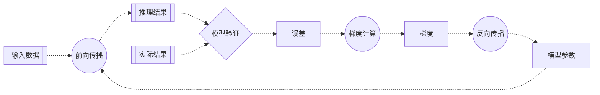

# 第三章 梯度下降：机器学习的核心机制

> 机器学习的核心是**参数优化**（Optimization）。<br>
> **梯度下降**（Gradient Descent）是最基本、也是最重要的优化算法，是机器学习的核心机制。

在第二章中，我们引入了损失函数（以均方误差为例）作为量化模型推理性能的工具。通过计算，我们得到了一个巨大的误差，这明确地指示了模型的初始参数（权重与偏置）远非最优。此结论引出一个核心问题：应遵循何种系统性方法来调整这些参数，从而使损失函数的误差最小化？手动试错式地调整参数在多维空间中显然是不可行的。因此，我们需要一个能够自动化此过程的算法。

梯度下降就是解决这个问题的工具。它是机器学习中最基本、也是最重要的优化算法，能够帮助我们自动找到最优的模型参数。

### 梯度下降的基本思想

想象你在一个山坡上，目标是找到最低点。如果你被蒙上眼睛，只能通过脚下的坡度来判断方向，你会怎么做？

最直观的方法就是：感受脚下的坡度，然后朝着最陡的下坡方向走一步，然后再次感受坡度，继续朝最陡的下坡方向走，如此反复，最终就能到达最低点。

梯度下降的原理与此完全相同：

- 目标是找到最低点：目标是找到损失函数的最小误差。
- 坡度最陡：损失函数的梯度（导数）。
- 下坡方向：损失函数误差减少的方向。
- 走一步：更新一次模型参数。

通过重复此过程，算法会引导参数逐步地朝降低损失函数误差的方向变化，并有望最终收敛于一个全局或者局部的最优解。

### 梯度计算

在数学上，**梯度**（Gradient）是一个向量。函数在某一点的梯度指向该函数值增长最快的方向。相应地，该点的**负梯度**（Negative Gradient）则指向函数值下降最快的方向。

因此，为了最高效地降低损失，我们应在每一步都沿着负梯度的方向来更新模型参数。

对于均方误差损失函数，通过求导计算梯度的公式为：

$$\delta_i = \frac{\partial MSE}{\partial \hat{y_i}} = \frac{\partial}{\partial \hat{y_i}} (\hat{y_i} - y_i)^2 = 2(\hat{y_i} - y_i)$$

其中：
- $\delta_i$ 是梯度
- $\hat{y}_i$ 是推理结果
- $y_i$ 是实际结果

### 梯度下降

对于权重和偏置，我们也可以通过求导分别得出它们的梯度下降公式：

$$w_i = w_i - \delta_i x_i$$
$$b = b - \sum_{i=1}^{n} {\delta_i}$$

其中：
- $w_i$ 是权重
- $b$ 是偏置
- $x_i$ 是输入数据
- $\delta_i$ 是梯度

### 反向传播

从损失函数开始，反向逐级计算梯度，并最终更新每个模型参数的过程被称为反向传播（Back Propagation）。 对于我们当前最简单的人工神经元网络，这个过程很简单。但在未来更深、更复杂的网络中，反向传播算法是高效计算所有参数梯度的基石。

### 应用举例：小明的冰淇淋店

> 小明是一家冰淇淋店的老板，希望可以根据天气预报预测第二天的冰淇淋销量。<br>
> 输入数据：温度、湿度<br>
> 输出数据：冰淇淋销量

让我们用梯度下降来优化小明冰淇淋店的预测模型。

#### 梯度计算

首先，我们需要实现梯度计算函数：

```python
def gradient(p, y):
    return (p - y) * 2
```

#### 梯度下降

接下来实现反向传播函数，用于更新权重和偏置：

```python
def backward(x, d, w, b):
    return w - d * x, b - np.sum(d)
```

注意这里我们使用减法，因为我们要沿着负梯度方向移动，目的是减少均方误差。

#### 反向传播

现在我们可以完整地执行一次梯度的反向传播：

```python
delta = gradient(prediction, label)
weight, bias = backward(feature, delta, weight, bias)
```

### 流程图



### 完整代码

上面的几行代码，就完成了梯度下降、反向传播的过程。至此，我们的代码实现了模型训练的一次完整流程。

```python
import numpy as np

# 输入数据
feature = np.array([28.1, 58.0])
# 实际结果
label = np.array([165])

# 模型参数（权重和偏置）
weight, bias = np.array([[1, 1]]) / 2, np.array([0])

# 前向传播函数
def forward(x, w, b):
    return x.dot(w.T) + b

# 反向传播函数
def backward(x, d, w, b):
    return w - d * x, b - np.sum(d)

# 损失函数（均方误差）
def mse_loss(p, y):
    return ((p - y) ** 2).mean(axis=0)

# 梯度计算函数（损失函数的导数）
def gradient(p, y):
    return (p - y) * 2

# 模型推理
prediction = forward(feature, weight, bias)
# 模型验证
error = mse_loss(prediction, label)
# 梯度计算
delta = gradient(prediction, label)
# 反向传播
weight, bias = backward(feature, delta, weight, bias)

# 结果输出
print(f'预测冰淇淋销量：{prediction}')
print(f'均方误差：{error}')
print(f"权重：{weight}")
print(f"偏置：{bias}")
```

### 运行结果

```text
预测冰淇淋销量：[43.05]
均方误差：14871.802500000002
权重：[[ 6854.09 14146.7 ]]
偏置：[243.9]
```

从结果可以看出：

- 经过一次梯度的反向传播，权重和偏置就发生了巨大的变化。这是因为初始误差非常大，导致计算出的梯度也相应地非常大，从而引发了一次大幅度的参数调整。
- 梯度告诉我们参数应该朝哪个方向调整。由于推理结果偏小，梯度为负值，反向传播会增加权重和偏置的值，从而在下次预测时产生更大的推理结果。

至此，我们已经构建了一个能够自动学习和调整的最小系统。然而，单次更新是远远不够的，并且如此剧烈的更新也可能导致问题。在后续章节，我们将探讨如何通过多次迭代以及引入学习率的概念来使训练过程更加稳定和有效。