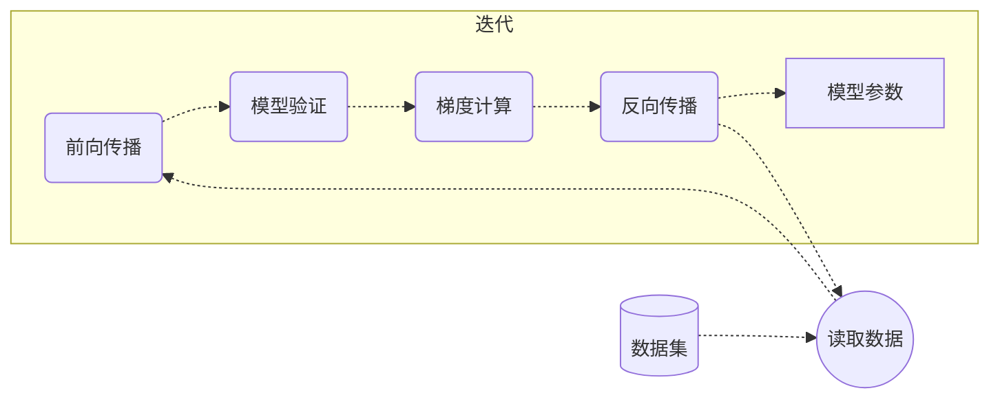

# 第四章 迭代：大数据驱动优化

- 机器学习的精髓在于从数据中学习。
- **数据集**（Dataset）提供了机器学习**泛化**（Generalization）的能力。

前三章中，我们成功地执行了一次完整的训练流程：通过前向传播完成模型推理，利用损失函数量化误差，并借助梯度下降与反向传播对模型参数进行了一次优化。但是，整个过程仅基于一个孤立的数据样本。这种基于单一样本的学习存在一个根本性的局限：模型参数的更新完全被这一个样本的特性所主导，其结果可能不具备泛化能力。

### 泛化

泛化是指一个机器学习模型在未经训练的、全新的数据上表现良好的能力。要获得这种能力，模型必须从一个多样化的、具有代表性的数据集中学习，而非仅仅记忆一个或几个特定样本。通过接触大量数据，模型得以从各种具体实例中提取出普遍存在的潜在模式与规律。因此，从处理单一样本过渡到处理整个数据集，是模型训练从理论演示走向实际应用的关键一步。

### 迭代

当拥有一个包含多个样本的数据集时，我们应如何利用它来训练模型？最直接的方法是**迭代**（Iteration）。迭代是指逐一地、顺序地将数据集中的每个样本提供给模型，并对每个样本执行一次完整的训练步骤（前向传播、误差计算、反向传播与参数更新）。

这个过程可以概括如下：

- 从数据集中取出第一个样本。
- 使用该样本训练模型，并更新一次模型参数，完成一次迭代。
- 从数据集中取出第二个样本。
- 使用该样本继续训练模型，在上一步更新后的参数基础上，再次进行更新，从而完成第二次迭代。

重复此过程，直至数据集中所有样本都被处理完毕。

模型参数在每次迭代都会被微调。它就像一个学生，在连续学习了多份不同的学习资料后，其知识体系在不断地被修正和完善。这种逐一样本更新参数的梯度下降方法，称为**随机梯度下降**（Stochastic Gradient Descent, SGD）。

### 应用举例：小明的冰淇淋店

> 小明是一家冰淇淋店的老板，希望可以根据天气预报预测第二天的冰淇淋销量。<br>
> 输入数据：温度、湿度<br>
> 输出数据：冰淇淋销量

为了使冰淇淋销量预测模型更具实用性，小明整理了五天的销售记录。我们现在将使用这个包含五个数据样本的数据集来训练模型。

#### 数据集

首先，我们需要定义一个新的、包含多个样本的数据集。在 NumPy 中，这通常通过一个二维数组（矩阵）来实现，其中每一行代表一个独立的样本。

- 特征（features）: 一个 5x2 的矩阵，每行包含两个值（温度和湿度）。
- 标签（labels）: 一个 5x1 的矩阵，每行包含一个值（实际冰淇淋销量）。

```python
features = np.array([[28.1, 58.0],
                     [22.5, 72.0],
                     [31.4, 45.0],
                     [19.8, 85.0],
                     [27.6, 63]])
labels = np.array([[165],
                   [95],
                   [210],
                   [70],
                   [155]])
```

#### 迭代

我们通过一个循环结构（例如 Python 的 for 循环）来遍历数据集中的每一个样本。在循环的每一次迭代中，我们执行与第三章完全相同的训练步骤。

```python
for i in range(len(features)):
    feature, label = features[i], labels[i]

    prediction = forward(feature, weight, bias)
    error = mse_loss(prediction, label)
    delta = gradient(prediction, label)
    weight, bias = backward(feature, delta, weight, bias)
```

### 流程图



### 完整代码

以下代码实现了对整个数据集的一次完整遍历：

```python
import numpy as np

# 输入数据
features = np.array([[28.1, 58.0],
                     [22.5, 72.0],
                     [31.4, 45.0],
                     [19.8, 85.0],
                     [27.6, 63]])
# 实际结果
labels = np.array([[165],
                   [95],
                   [210],
                   [70],
                   [155]])

# 模型参数（权重和偏置）
weight, bias = np.array([[1, 1]]) / 2, np.array([0])

# 前向传播函数
def forward(x, w, b):
    return x.dot(w.T) + b

# 反向传播函数
def backward(x, d, w, b):
    return w - d * x, b - np.sum(d)

# 损失函数（均方误差）
def mse_loss(p, y):
    return ((p - y) ** 2).mean()

# 梯度计算函数（损失函数的导数）
def gradient(p, y):
    return (p - y) * 2

# 迭代
for i in range(len(features)):
    feature, label = features[i], labels[i]

    # 模型推理
    prediction = forward(feature, weight, bias)
    # 模型验证
    error = mse_loss(prediction, label)
    # 梯度计算
    delta = gradient(prediction, label)
    # 反向传播
    weight, bias = backward(feature, delta, weight, bias)

    # 结果输出
    print(f'预测冰淇淋销量：{prediction}')
    print(f'均方误差：{error / len(features)}')
    print(f"权重：{weight}")
    print(f"偏置：{bias}")
```

### 运行结果

```text
预测冰淇淋销量：[43.05]
均方误差：2974.3605000000002
权重：[[ 6854.09 14146.7 ]]
偏置：[243.9]
预测冰淇淋销量：[1173023.325]
均方误差：275152171117.46106
权重：[[-5.27749205e+07 -1.68887532e+08]]
偏置：[-2345612.75]
预测冰淇淋销量：[-9.25941706e+09]
均方误差：1.7147361643583869e+19
权重：[[5.81438630e+11 8.33178667e+11]]
偏置：[1.85164889e+10]
预测冰淇淋销量：[8.2351188e+13]
均方误差：1.3563436346208885e+27
权重：[[-3.26052561e+15 -1.39988688e+16]]
偏置：[-1.6468386e+14]
预测冰淇淋销量：[-9.72083924e+17]
均方误差：1.8898943121299376e+35
权重：[[5.36557721e+19 1.22468576e+20]]
偏置：[1.94400316e+18]
```

通过观察每次迭代的输出，我们可以发现：

- 在每次迭代中，权重和偏置都在发生变化。 它们的变化方向和幅度取决于当前样本的特征及其产生的误差。
- 均方误差并不会在每次迭代后都必然减小。也就是说每次迭代不是必然增加模型的预测能力。
- 参数调整的幅度可能非常大，难以收敛到最优解。

至此，我们成功地让模型学习了一个完整的数据集，这是迈向构建实用模型的重要一步。然而，当前的学习过程显得较为粗放和不稳定。如何更精细地控制参数的更新步伐，以实现更平滑、更高效的收敛？下一章我们将引入一个简单、但是有效的概念：学习率。
