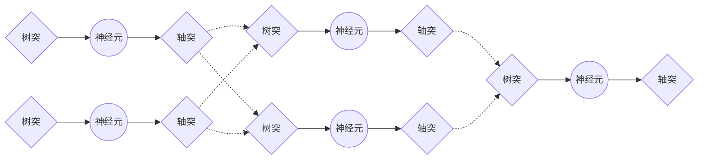
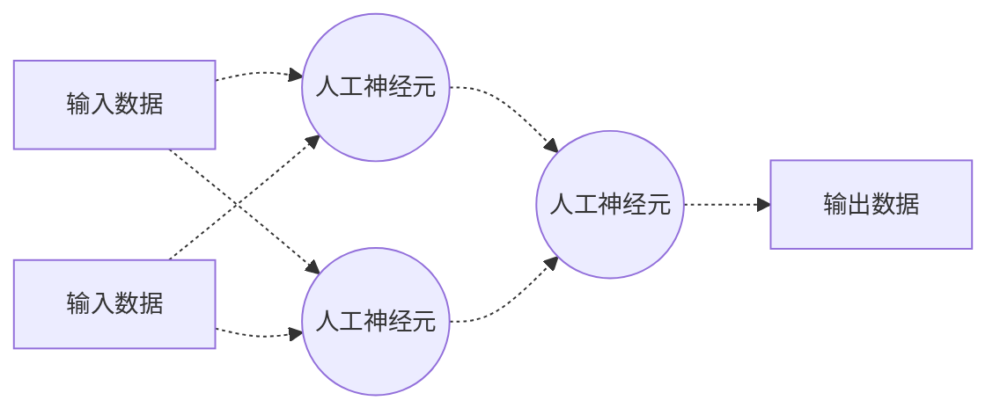
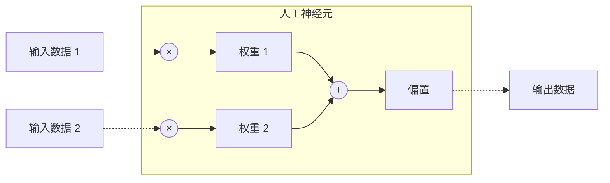

# 最简单的人工神经元网络

> 深度学习是机器学习的一个分支，而机器学习是人工智能的一个分支。<br>
> 深度学习的核心是人工神经元网络，而人工神经元网络是仿生人类自身神经系统的计算模型。

人类自身神经系统是由大量的神经元细胞组成的网络。每个单独的神经元只能有限地处理少量的生物电信号，而数量庞大的神经元组合在一起，却可以完成感知、思考、记忆、决策以及操控等一系列强大的功能。



类似的仿生结构在计算机领域并不少见，比如处理器中大量的逻辑门，或者存储器中大量的存储单元。而人工神经元网络（Artificial Neural Network，缩写ANN）则是由大量的人工神经元（artificial neuron，简称neuron）组成。



### 人工神经元

最简单的人工神经元网络只包含一个人工神经元。这个神经元使用不同的权重（weight）和偏置（bias），对输入数据（features）进行加权组合（强化一些数据，削弱另一些数据），最终输出一个线性回归的结果（prediction）。其数学公式为：

$$y = w_1x_1 + w_2x_2 + \dots + w_nx_n + b$$

其中：
- $x_1, x_2, \dots, x_n$是输入数据， $y$是输出结果
- $w_1, w_2, \dots, w_n$是权重， $b$是偏置



### 应用举例：小明的冰淇淋店

这样的微型人工神经元网络已经可以帮助我们做一些工作。比如预测一个冰激凌店的销量：

> 小明是一家冰淇淋店的老板，希望可以根据天气预报预测第二天的冰淇淋销量。<br>
> 输入数据：温度、湿度<br>
> 输出数据：冰淇淋销量

### 输入数据

为了完成这项工作，我们首先需要一些输入数据。比如明天的天气预报，包括：

> 温度：28.1<br>
> 湿度：58.0

这样我们就有了第一行代码，用数组来表达输入数据：

```python
feature = np.array([28.1, 58.0])
```

这里我们使用了Python的科学计算库numpy，方便我们之后利用其强大的矩阵计算能力。

### 模型参数（权重和偏置）

输入数据包括两个数值，因此我们需要相应的包括两个变量的权重和总是只有一个变量的偏置：

```python
weight, bias = np.array([1, 1]), np.array([0])
```

这样我们就创建了对应两个输入（列）和一个输出（行）的权重数组，缺省值设为1；以及对应一个输出的偏置数组，缺省值设为0。

### 神经元逻辑

单个人工神经元的计算逻辑非常简单，就是一个线性回归函数：

```python
forward = lambda x: x.dot(weight.T) + bias
```

这里我们使用了Python的匿名函数（lambda），和numpy的矩阵点积（dot()）和转置（T）的技巧。

### 模型推理

将我们得到的输入数据代入到神经元逻辑中，就完成了第一次的模型推理过程：

```python
prediction = forward(feature)
```

### 完整代码

上面的4行代码，就可以实现一个最简单的人工神经元网络。为了让代码有效运行，我们还要加上库引用和结果输出。

```python
import numpy as np

# 输入数据
feature = np.array([28.1, 58.0])

# 模型参数（权重和偏置）
weight, bias = np.array([1, 1]), np.array([0])

# 神经元逻辑
forward = lambda x: x.dot(weight.T) + bias

# 模型推理
prediction = forward(feature)

# 结果输出
print(f'预测冰淇淋销量：{prediction}')
```

### 运行结果

```text
预测冰淇淋销量：[86.1]
```

我们的模型预测，明天小明的冰淇淋店可以卖出大约86个冰淇淋。模型的预测准确吗？


