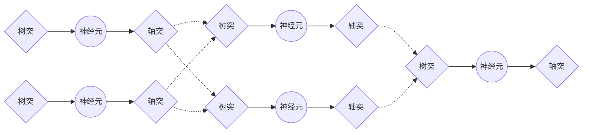
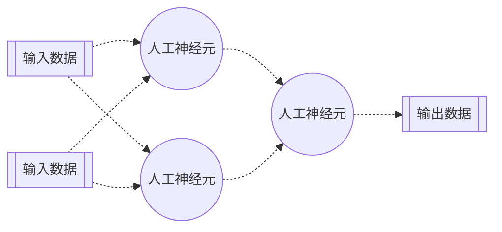
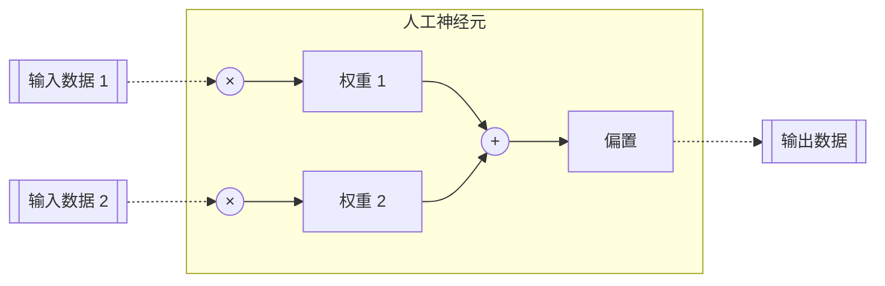
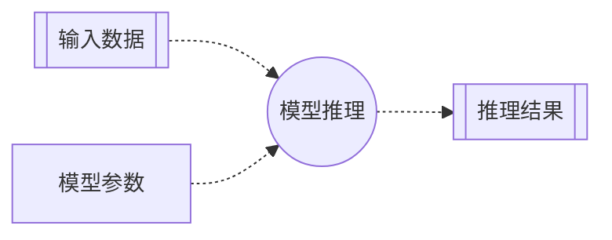

# 第一章 人工神经元：最简单的人工神经元网络

> **深度学习**（Deep Learning, DL）是**机器学习**（Machine Learning, ML）的一个分支，而机器学习是**人工智能**（Artificial Intelligence, AI）的一个分支。<br>
> 深度学习的核心是**人工神经元网络**（Artificial Neural Networks, ANN），而人工神经元网络是仿生人类自身神经系统的计算模型。

人类自身神经系统是由数百亿个神经元细胞通过突触连接构成的一个极为复杂的网络。每个单独的神经元只能有限地处理少量的生物电信号，而数量庞大的神经元组合在一起，却可以实现强大的信息处理能力，从而涌现出感知、记忆与认知等高级功能。



类似的仿生结构在计算机领域并不少见，比如处理器中大量的逻辑门，或者存储器中大量的存储单元。而人工神经元网络则是由大量的**人工神经元**（artificial neuron，简称neuron）组成。



### 人工神经元

> 每个人工神经元就是一个线性回归（多元一次）函数。

最简单的人工神经元网络可以只包含一个人工神经元。这个神经元使用不同的**权重**（weight）和**偏置**（bias），对输入数据，又称为**特征**（feature）进行加权组合（强化一些数据，削弱另一些数据），最终输出一个线性回归的推理结果，又称为**预测**（prediction）。其数学公式为：

$$y = w_1x_1 + w_2x_2 + \dots + w_nx_n + b$$

其中：
- $x_1, x_2, \dots, x_n$ 是输入数据（特征）
- $y$ 是推理结果（预测）
- $w_1, w_2, \dots, w_n$ 是权重
- $b$ 是偏置



权重是模型的关键参数，每个权重 $w_i$ 与对应的输入数据 $ x_i$ 相关联，用以衡量该输入对于最终输出的影响程度。一个绝对值较大的权重意味着其对应的输入在模型的推理过程中更重要。权重参数的优化是模型训练过程的核心。

而偏置是一个相对独立的参数，不与任何输入数据相关联。其作用是为模型提供一个可调节的基准线，使得输出能够平移，从而增强模型的拟合能力。

### 应用举例：小明的冰淇淋店

这样的微型人工神经元网络已经可以帮助我们做一些工作。比如预测小明的冰激凌店的销量：

> 小明是一家冰淇淋店的老板，希望可以根据天气预报预测第二天的冰淇淋销量。<br>
> 输入数据：温度、湿度<br>
> 推理结果：冰淇淋销量

#### 输入数据

为了完成这项工作，我们首先需要一些输入数据。比如明天的天气预报：

> 温度：28.1<br>
> 湿度：58.0

这样我们就有了第一行代码，用数组来表示输入数据：

```python
import numpy as np
feature = np.array([28.1, 58.0])
```

这里我们使用了Python的科学计算库NumPy，方便我们之后利用其强大的矩阵计算能力。

#### 模型参数（权重和偏置）

输入数据包括两个特征值，因此我们需要相应的包括两个变量的权重和总是只有一个变量的偏置：

```python
weight, bias = np.array([[1, 1]]) / 2, np.array([0])
```

这样我们就创建了对应两个输入（列）和一个输出（行）的权重矩阵，缺省值的总和为1；以及对应一个输出的偏置数组，缺省值为0。

#### 神经元逻辑（前向传播）

单个人工神经元的计算过程，即从输入到输出的映射，可以通过一个多元一次函数来实现。该过程被称为**前向传播**（Forward Propagation）：

```python
def forward(x, w, b):
    return x.dot(w.T) + b
```

这里我们使用了NumPy的矩阵**点积**（dot()）和**转置**（T）的技巧，来一次性计算出多个输入数据和权重的乘积的和。

#### 模型推理

将输入数据，权重和偏置代入到神经元逻辑函数中，我们就完成了第一次的**模型推理**（Inference）：

```python
prediction = forward(feature, weight, bias)
print(f'预测冰淇淋销量：{prediction}')
```

### 流程图



### 完整代码

上面的几行代码，就实现了一个最简单的人工神经元网络：

```python
import numpy as np

# 输入数据
feature = np.array([28.1, 58.0])

# 模型参数（权重和偏置）
weight, bias = np.array([[1, 1]]) / 2, np.array([0])

# 前向传播
def forward(x, w, b):
    return x.dot(w.T) + b

# 模型推理
prediction = forward(feature, weight, bias)
# 结果输出
print(f'预测冰淇淋销量：{prediction}')
```

### 运行结果

```text
预测冰淇淋销量：[43.05]
```

我们的最简单的人工神经元网络模型预测：明天小明的冰淇淋店可以卖出大约43个冰淇淋。

模型的预测准确吗？


