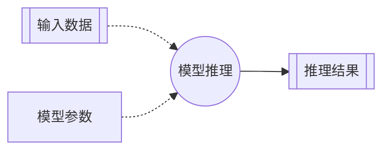
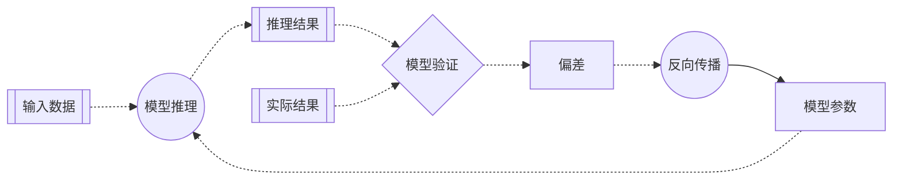
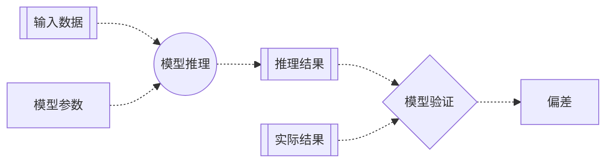

# 第二章 损失函数：用均方差验证模型

> 机器学习包括模型训练和模型推理两个阶段。<br>
> 模型训练则是包括模型推理、模型验证和反向传播三个步骤的多次迭代。

在第一章，我们讨论了一个最简单的人工神经元网络的模型推理过程。对于已经训练成功的模型，模型推理是指利用新的输入数据进行预测。



而对于正在训练的模型，模型推理则是迭代中的第一个步骤。之后模型验证的步骤计算推理结果和实际结果的偏差，最后反向传播的步骤根据验证结果逆向调整模型参数。模型训练就是通过多次这样的迭代，逐步优化模型参数。



### 损失函数

那么我们怎样验证模型推理的结果是否准确呢？

其实很简单。就是将推理结果和实际结果进行比较，看偏差的大小。偏差大就说明不准确，偏差小就说明比较准确。模型训练的过程就是将模型验证的偏差逐渐缩小的过程。

用来比较推理结果和实际结果的数学方法被称为损失函数。最常用的损失函数包括：用于回归模型的均方差损失函数，和用于分类模型的交叉熵损失函数。

### 均方差

对于小明的冰淇淋店这样的回归模型，我们通常采用均方差损失函数。

均方差损失函数的计算方法是：将推理结果与实际结果的差值求平方，然后取平均值。数学公式为：

$$\mathrm{MSE} = \frac{1}{n} \sum_{i=1}^{n} (y_i - \hat y_i)^2$$

其中：
- $n$是样本数量
- $y_i$是实际结果
- $\hat y_i$是推理结果

采用均方差，而不是直接用实际结果和推理结果的差值来作为模型验证的标准。是因为均方差具有一些显著的优点：
- 非负：均方差的结果永远是非负值，这样平均值才不会互相抵消。
- 放大：均方差会放大较大的差值，这样偏差大的数据将得到更多的关注。
- 可导：均方差函数可以求导数，这样才能计算梯度。

### 应用举例：小明的冰淇淋店

现在，让我们用均方差损失函数来验证一下我们在第一章里建立的，最简单的人工神经元网络的模型推理结果：

> 小明是一家冰淇淋店的老板，希望可以根据天气预报预测第二天的冰淇淋销量。<br>
> 输入数据：温度、湿度<br>
> 输出数据：冰淇淋销量

#### 实际结果

在第一章，我们的最简单的人工神经元网络预测，第二天小明的冰淇淋店可以卖出大约43个冰淇淋。实际上，第二天小明的冰淇淋大卖。实际销量为：

> 冰淇淋销量：165

我们仍然用数组来表示这个实际结果：

```python
label = np.array([165])
```

#### 损失函数

一眼就可以看出，模型推理的结果非常不准确。为什么呢？因为我们的模型还没有经过训练。模型参数（权重和偏置）还是缺省值的状态。深度学习的核心就是从一组并不准确的模型参数开始，通过多轮次对大量数据的学习，逐渐优化模型参数。

对于小明的冰淇淋店这样的回归模型，通常采用均方差作为损失函数：

```python
def mse_loss(p, y):
    return ((p - y) ** 2).mean()
```

#### 模型验证

模型验证的过程也很简单，就是将推理结果和实际结果代入到损失函数：

```python
error = mse_loss(prediction, label)
```

### 流程图



### 完整代码

上面的4行代码，就完成了模型验证的过程。我们来看一下实现了模型推理和模型验证两个步骤的完整的代码：

```python
import numpy as np

# 输入数据
feature = np.array([28.1, 58.0])
# 实际结果
label = np.array([165])

# 模型参数（权重和偏置）
weight, bias = np.array([[1, 1]]) / 2, np.array([0])

# 神经元逻辑（线性回归（多元一次）函数）
def forward(x, w, b):
    return x.dot(w.T) + b

# 损失函数（均方差）
def mse_loss(p, y):
    return ((p - y) ** 2).mean()

# 模型推理
prediction = forward(feature, weight, bias)
# 模型验证
error = mse_loss(prediction, label)
# 结果输出
print(f'预测冰淇淋销量：{prediction}')
print(f'均方差：{error}')
```

### 运行结果

```text
预测冰淇淋销量：[43.05]
均方差：14871.802500000002
```

可以看出，偏差还是很大的。这说明目前模型的推理能力还很差。不过不要着急，下一章我们将进入模型训练的核心环节：梯度下降和向后传播。