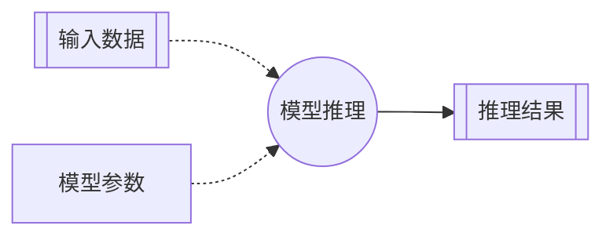
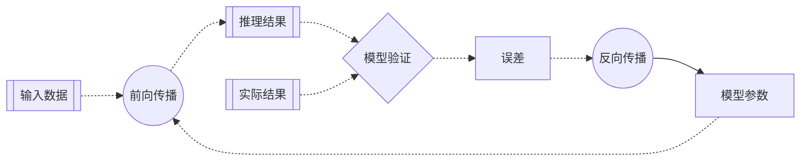
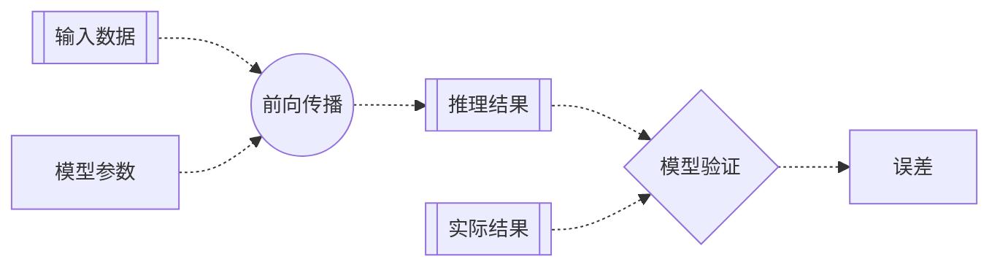

# 第二章 损失函数：用均方误差验证模型

> 机器学习包括**模型训练**（Training）和**模型推理**（Inference）两个阶段。<br>
> 模型训练则是包括**前向传播**（Forward Propagation）、**模型验证**（Validation）和**反向传播**（Back Propagation）三个步骤的多次迭代。

在第一章，我们讨论了一个最简单的人工神经元网络的模型推理过程。对于已经训练成功的模型，模型推理是指利用新的输入数据进行预测。



而对于正在训练的模型，模型推理则被用作迭代中的第一个步骤：前向传播。之后模型验证的步骤计算推理结果和实际结果的误差，最后反向传播的步骤根据验证结果逆向调整模型参数。模型训练就是通过多次这样的迭代，逐步优化模型参数。



### 损失函数

那么我们怎样验证模型推理的结果是否准确呢？

其实很简单。就是将推理结果和实际结果进行比较，看误差的大小。误差大就说明不准确，误差小就说明比较准确。模型训练的过程就是将模型验证的误差逐渐缩小的过程。

用来比较推理结果和实际结果的数学方法被称为**损失函数**（Loss Function）。最常用的损失函数包括：

- 回归问题（Regression）：当推理结果为连续值时（比如预测价格、销量），通常采用**均方误差**（Mean Squared Error, MSE）损失函数。
- 分类问题（Classification）：当推理结果为有限离散值时（比如垃圾邮件判断、手写数字识别），通常采用**交叉熵**（Cross-Entropy）损失函数。

### 均方误差

对于小明的冰淇淋店这样的回归问题，均方误差是应用最广泛的损失函数。

均方误差损失函数的计算方法是：将推理结果与实际结果的差值求平方，然后取平均值。数学公式为：

$$\mathrm{MSE} = \frac{1}{n} \sum_{i=1}^{n} (y_i - \hat y_i)^2$$

其中：
- $n$ 是样本数量
- $y_i$ 是第 $i$ 个实际结果
- $\hat y_i$ 是第 $i$ 个推理结果

采用均方误差，而不是直接用实际结果和推理结果的差值来作为模型验证的标准，是因为均方误差具有一些显著的优点：
- 非负：均方误差的结果永远是非负值，这样平均值才不会互相抵消。
- 放大：均方误差会放大较大的差值。这意味着，相比于多个小的偏差，模型会更倾向于去修正那些偏差极大的预测，因为后者对总损失的影响更大。
- 可导：均方误差函数可以求导数，这样才能在反向传播步骤进行有效的计算。

### 应用举例：小明的冰淇淋店

现在，让我们用均方误差损失函数来验证一下我们在第一章里建立的最简单的人工神经元网络的推理结果：

> 小明是一家冰淇淋店的老板，希望可以根据天气预报预测第二天的冰淇淋销量。<br>
> 输入数据：温度、湿度<br>
> 输出数据：冰淇淋销量

#### 实际结果

在第一章，我们建立的最简单的人工神经元网络预测：第二天小明的冰淇淋店可以卖出大约43个冰淇淋。

实际上，第二天小明的冰淇淋大卖。实际销量为：

> 冰淇淋销量：165

我们依然用数组来表示这个**实际结果**，又称为**标签**（Label）：

```python
label = np.array([165])
```

#### 损失函数

实际上，我们一眼就可以看出，模型推理的结果非常不准确。

为什么呢？因为我们的模型还没有经过训练。模型参数（权重和偏置）还是缺省值的状态。深度学习的核心就是从一组并不准确的模型参数开始，通过多轮次对大量数据的学习，逐渐优化模型参数。

对于小明的冰淇淋店这样的回归问题，通常采用均方误差作为损失函数：

```python
def mse_loss(p, y):
    return ((p - y) ** 2).mean()
```

#### 模型验证

模型验证的过程也很简单，就是将推理结果和实际结果代入到损失函数：

```python
error = mse_loss(prediction, label)
```

### 流程图



### 完整代码

上面的几行代码，就完成了模型验证的过程。我们来看一下实现了前向传播和模型验证两个步骤的完整代码：

```python
import numpy as np

# 输入数据
feature = np.array([28.1, 58.0])
# 实际结果
label = np.array([165])

# 模型参数（权重和偏置）
weight, bias = np.array([[1, 1]]) / 2, np.array([0])

# 前向传播
def forward(x, w, b):
    return x.dot(w.T) + b

# 损失函数（均方误差）
def mse_loss(p, y):
    return ((p - y) ** 2).mean()

# 模型推理
prediction = forward(feature, weight, bias)
# 模型验证
error = mse_loss(prediction, label)

# 结果输出
print(f'预测冰淇淋销量：{prediction}')
print(f'均方误差：{error}')
```

### 运行结果

```text
预测冰淇淋销量：[43.05]
均方误差：14871.802500000002
```

可以看出误差还是很大的，说明目前模型的推理能力还很差。这完全符合预期，因为模型的参数是任意设定的，并未经过任何学习和优化。然而，这个误差本身并非失败。恰恰相反，它是在模型训练这个漫长旅程中，我们获得的第一份、也是最重要的一份反馈，为我们下一步如何优化模型指明了方向。

在下一章中，我们将开始探讨如何利用这个误差，通过梯度下降与反向传播算法来智能地、自动化地调整模型参数，从而开启真正的“学习”过程。