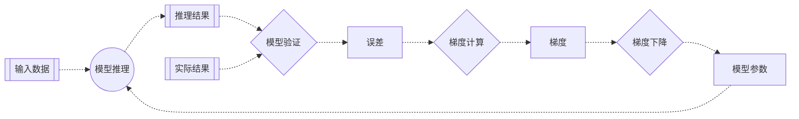

# 第三章 梯度下降：机器学习的秘密武器

> 机器学习的核心是自动优化模型参数。<br>
> 梯度下降是最核心的优化算法，是机器学习的秘密武器。

在第二章，我们发现模型的预测结果与实际结果相差很大，误差高达14872。这说明我们的模型参数（权重和偏置）需要调整。但是问题来了：我们应该如何调整这些参数，才能让模型的预测更准确呢？

梯度下降（Gradient Descent）就是解决这个问题的秘密武器。它是机器学习中最核心的优化算法，能够自动找到最优的模型参数。

### 梯度下降的基本思想

想象你在一个山坡上，目标是找到最低点。如果你被蒙上眼睛，只能通过脚下的坡度来判断方向，你会怎么做？

最直观的方法就是：感受脚下的坡度，然后朝着最陡的下坡方向走一步，然后再次感受坡度，继续朝最陡的下坡方向走，如此反复，最终就能到达最低点。

梯度下降的原理与此完全相同：

- 寻找最低点：对应寻找损失函数的最小值。
- 坡度最陡：对应损失函数的梯度（导数）。
- 下坡方向：对应损失函数误差减少的方向。
- 走一步：对应更新一次模型参数。

### 梯度计算

对于均方误差损失函数，我们可以通过求导计算它的梯度：

$$\delta_i = 2(y_i - \hat{y}_i)$$

其中：
- $\delta_i$ 是梯度
- $y_i$ 是实际结果
- $\hat{y}_i$ 是推理结果

### 梯度下降

对于权重和偏置，我们也可以通过求导分别计算它们的梯度下降公式：

$$w_i = w_i - \delta_i x_i$$
$$b = b - \sum_{i=1}^{n} {\delta_i}$$

其中：
- $w_i$ 是权重
- $b$ 是偏置
- $x_i$ 是输入数据
- $\delta_i$ 是梯度

### 反向传播

计算梯度，根据梯度下降公式调整每个模型参数的过程被称为反向传播（Backpropagation）。 

### 应用举例：小明的冰淇淋店

让我们用梯度下降来优化小明冰淇淋店的预测模型：

> 小明是一家冰淇淋店的老板，希望可以根据天气预报预测第二天的冰淇淋销量。<br>
> 输入数据：温度、湿度<br>
> 输出数据：冰淇淋销量

#### 梯度计算

首先，我们需要实现梯度计算函数：

```python
def gradient(p, y):
    return (p - y) * 2
```

#### 梯度下降

接下来实现反向传播函数，用于更新权重和偏置：

```python
def backward(x, d, w, b):
    return w - d * x, b - np.sum(d)
```

注意这里我们使用减法，因为我们要沿着负梯度方向移动，目的是减少均方误差。

#### 反向传播

现在我们可以完整地执行一次梯度的反向传播：

```python
delta = gradient(prediction, label)
weight, bias = backward(feature, delta, weight, bias)
```

### 流程图



### 完整代码

上面的6行代码，就完成了反向传播的过程。至此，我们的代码实现了模型训练的一次完整流程。

```python
import numpy as np

# 输入数据
feature = np.array([28.1, 58.0])
# 实际结果
label = np.array([165])

# 模型参数（权重和偏置）
weight, bias = np.array([[1, 1]]) / 2, np.array([0])

# 神经元逻辑（线性回归（多元一次）函数）
def forward(x, w, b):
    return x.dot(w.T) + b

# 反向传播
def backward(x, d, w, b):
    return w - d * x, b - np.sum(d)

# 损失函数（均方误差）
def mse_loss(p, y):
    return ((p - y) ** 2).mean(axis=0)

# 梯度计算（损失函数的导数）
def gradient(p, y):
    return (p - y) * 2

# 模型推理
prediction = forward(feature, weight, bias)
# 模型验证
error = mse_loss(prediction, label)
# 梯度计算
delta = gradient(prediction, label)
# 反向传播
weight, bias = backward(feature, delta, weight, bias)
# 结果输出
print(f'预测冰淇淋销量：{prediction}')
print(f'均方误差：{error}')
print(f"权重：{weight}")
print(f"偏置：{bias}")
```

### 运行结果

```text
预测冰淇淋销量：[43.05]
均方误差：14871.802500000002
权重：[[ 6854.09 14146.7 ]]
偏置：[243.9]
```

从结果可以看出：经过一次梯度的反向传播，权重和偏置都显著增加。梯度告诉我们参数应该朝哪个方向调整。由于推理结果偏小，梯度为负值，反向传播会增加权重和偏置的值，从而在下次预测时产生更大的推理结果。