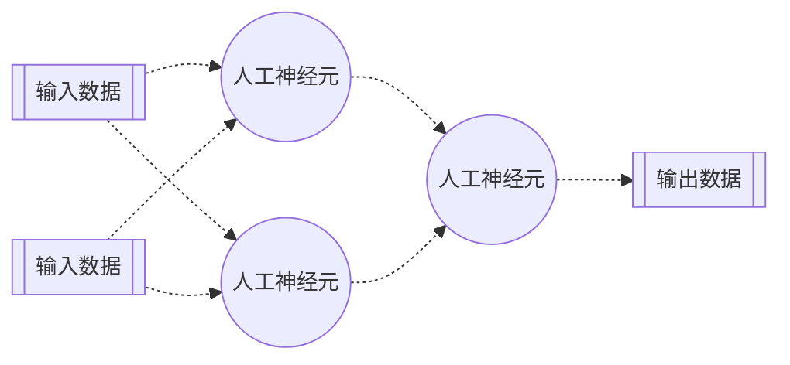
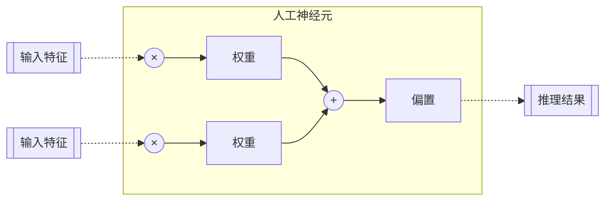
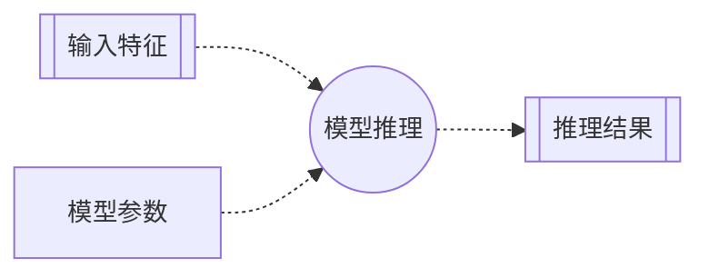

# 第一章 人工神经元：基础计算单元

## 引言：学科背景与层级关系

在当代计算科学领域，**人工智能**（Artificial Intelligence, AI）、**机器学习**（Machine Learning, ML）与**深度学习**（Deep Learning, DL）是三个关联紧密且具层级关系的核心概念。

- 人工智能（AI） 是一个广阔的学科领域，其根本目标在于构建能够模拟、延伸乃至超越人类智能的理论、方法、技术及应用系统。其研究范围涵盖了推理、知识表示、规划、学习、自然语言处理、感知以及支持物理操作等多个方面。
- 机器学习（ML） 作为实现人工智能的核心方法之一，其主要特征在于不依赖于显式编程，而是通过设计算法来解析数据、从中学习，并利用学习到的模式进行判断和预测。例如，垃圾邮件过滤系统便是通过分析大量邮件样本，自动学习并识别垃圾邮件的特征，从而实现有效分类。
- 深度学习（DL） 是机器学习的一个重要分支，其理论基础源于对**人工神经元网络**（Artificial Neural Networks, ANN）的研究。深度学习通过构建包含多个处理层的复杂模型，以实现对数据中更高层次抽象特征的学习。近年来，深度学习在图像识别、语音处理和自动驾驶等诸多领域取得了突破性进展，并已成为推动技术革新的关键力量。

人工神经元网络构成了深度学习的理论基石。其设计灵感源于对**生物神经元系统**的仿生学研究，特别是对人类大脑结构的模拟。大脑由数百亿个称为**神经元**的细胞通过突触连接构成一个极为复杂的网络。单个神经元的功能相对简单，但其大规模的并行互联赋予了系统强大的信息处理能力，从而涌现出感知、记忆与认知等高级功能。在计算领域，正是对这种生物结构的高度抽象和数学建模，催生了**人工神经元**（artificial neuron，简称neuron）的概念。



## 人工神经元：基本定义与数学模型

从形式化角度定义，一个基础的人工神经元是一个执行线性变换并叠加一个偏置项的计算单元。该过程将一组输入信号转换为一个输出信号。

其数学表达如下：

$$y = w_1x_1 + w_2x_2 + \dots + w_nx_n + b$$

其中：

- $x_1, x_2, \dots, x_n$ 代表一组**输入特征**（features）。在多维数据中，每一个 $x_i$ 对应一个数据点的特定维度。例如，在视觉任务中，输入特征可以是图像的像素值集合；在本次的案例中，则是指代温度与湿度这两个环境变量。
- $w_1, w_2, \dots, w_n$ 代表一组**权重**（weights）。权重是模型的关键参数，每个权重 $w_i$ 与对应的输入特征 $x_i$ 相关联，用以衡量该特征对于最终输出的影响程度。一个绝对值较大的权重意味着其对应的输入特征在模型的决策过程中占有更高的重要性。权重参数的优化是模型训练过程的核心。
- $b$ 代表**偏置**（bias）项。偏置是一个独立的参数，不与任何输入特征相关联。其作用是为模型提供一个可调节的基准线，使得输出激活函数能够平移，从而增强模型的拟合能力。若无偏置项，神经元的激活函数将必然穿过坐标原点，这在一定程度上限制了模型的表达自由度。
- $y$ 代表该神经元的**输出**（output），或称为**预测值**、或**推理结果**（prediction）。它是对输入特征进行加权求和，并叠加偏置项后的计算结果。



尽管单个神经元作为一个线性计算单元，其功能有限。但通过将大量此类单元组织成多层次的网络结构，整个系统便能够学习并表达极其复杂的非线性关系。这种由简单单元组合而产生的复杂系统行为，正是深度神经网络强大能力的来源。


## 应用实例：商业销量的线性预测模型

为了具体说明上述概念，本节将展示一个基础的应用案例。此案例的目标是构建一个简单的预测模型，用于根据气象数据估算某商业实体的冰淇淋日销量。

- 任务输入：环境变量，具体为温度（temperature）与湿度（humidity）。
- 任务输出：预测的冰淇淋销量（ice cream sales volume）。

假设已获取的次日气象数据为：温度 28.1 摄氏度，湿度 58.0%。

### 第一步：输入数据的向量化表示

在进行数值计算时，通常需将输入数据结构化为向量或矩阵形式。Python 的 NumPy 库是执行此类科学计算的标准工具。此处，两个输入特征（温度与湿度）被表示为一个一维 NumPy 数组。

```python
import numpy as np

# 输入特征向量：包含温度与湿度两个元素
features = np.array([28.1, 58.0])
```

### 第二步：模型参数的初始化

一个人工神经元的行为由其权重和偏置参数决定。对于具有两个输入特征的系统，需要一个包含两个元素的权重向量和一个偏置标量。

在模型训练开始之前，参数值是未知的。因此，必须对它们进行初始化。一种常见的策略是随机初始化或根据先验知识设定初始值。这里为简化起见，设定权重均为 0.5（保持权重总和为 1），偏置为 0。此过程可视为在没有任何训练数据前，为模型赋予一个初始的、无偏见缺省状态。

```python
# 初始化模型参数
# 权重向量的维度须与特征向量的维度匹配
weights = np.array([[0.5, 0.5]])
# 偏置为标量
bias = np.array([0])
```

### 第三步：计算逻辑的函数化实现（前向传播）

模型的计算过程，即从输入到输出的映射，可以通过一个函数来实现。该过程在神经网络的语境中被称为前向传播 (Forward Propagation)。此函数严格遵循前述的线性模型公式。

```python
# 定义前向传播函数
def forward(x, w, b):
    # .dot() 用于计算向量点积, (w.T) 为权重的转置
    # 该操作高效地完成了加权求和
    return x.dot(w.T) + b
```

> 技术注解：<br>
> x.dot(w.T) 利用了 NumPy 的向量化计算能力。通过执行点积运算，可以避免使用显式的 for 循环来遍历并累加每个特征与权重的乘积，从而大幅提升计算效率。

### 第四步：执行模型预测（模型推理）

将输入数据和已初始化的参数传入前向传播函数，即可得到模型的推理结果。这个使用已定义模型进行预测的过程，称为模型推理（Inference）。

```python
# 执行模型推理
prediction = forward(features, weights, bias)
print(f'预测的冰淇淋销量为: {prediction}')
```

### 流程图



### 完整代码实现与初步分析

以下代码整合了上述所有步骤，构成了一个完整的基础人工神经元模型：

```python
import numpy as np

# 输入特征
features = np.array([28.1, 58.0])

# 初始化模型参数
weights = np.array([[0.5, 0.5]])
bias = np.array([0])

# 前向传播函数
def forward(x, w, b):
    return x.dot(w.T) + b

# 模型推理
prediction = forward(features, weights, bias)
# 输出结果
print(f'预测的冰淇淋销量为: {prediction}')
```

执行此代码将产生如下输出：

```text
预测的冰淇淋销量为: [43.05]
```

此结果表明：在当前参数设定下，模型预测的销量为 43.05 单位。

然而，此预测的有效性是存在疑问的。由于模型的参数是基于假设进行初始化的，而非通过数据驱动的方式获得，因此其推理结果与真实结果之间可能存在显著偏差。

这就引出了两个根本性的问题：第一，如何量化模型推理结果与真实结果之间的误差？第二，存在何种系统性的方法，能够根据该误差来自动调整并优化模型的权重与偏置参数？对这两个问题的解答，构成了后续章节的核心主题，并将引导我们进入模型训练与优化的关键领域。
